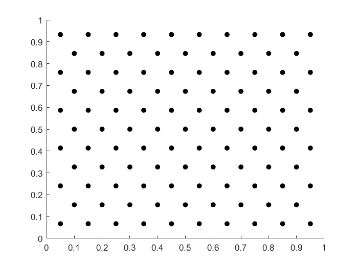
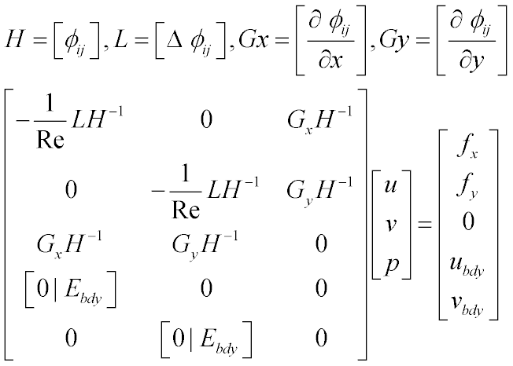
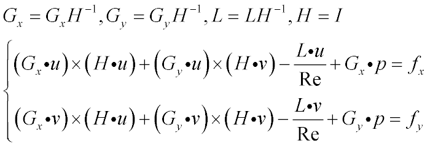
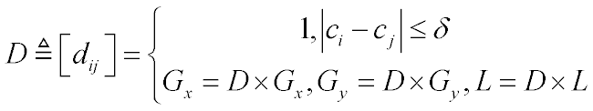

# RBF-2D-Lid-Cavity-Flow-Solver

## Description:

The solver system can be decomposed into six_average_sample.m,generate_couple.m and arbitrary_try.m.

### six_average_sample.m

This function has two input parameters: outer_radius and r to generate a hexagonal grid which covers a disk fixed in the coordinate origin.The mesh interval is r and the radius of the disk is outer_radius.

#### How to generate a hexagonal grid in $$\Omega=[0,1]^2$$?

Type in these codes in the command line and we get:

```matlab
CList= six_average_sample(1.0,1.0./10);
CList(:,1) = CList(:,1) + 0.5;
CList(:,2) = CList(:,2) + 0.5;
ind = find(CList(:,1)<1-0.015 & CList(:,2)<1-0.015 & CList(:,1)>0.015 & CList(:,2)>0.015);
S = CList(ind,:);
scatter(S(:,1),S(:,2),'filled','k')
interior = S;
save six_2_sample interior
```

and we get the picture:



### generate_couple.m

The function generate cartesian product of two vectors so it has two input paraments A,B

example:

```matlab
A = 1:2:7;
B = 2:2:10;
C = generate_couple(A,B);
>> C'

ans =

     1     2
     3     2
     5     2
     7     2
     1     4
     3     4
     5     4
     7     4
     1     6
     3     6
     5     6
     7     6
     1     8
     3     8
     5     8
     7     8
     1    10
     3    10
     5    10
     7    10
```

### arbitrary_try.m

First I introduce there functions of a radial basic function:$$\phi \left( r \right)$$

$$\Delta \phi \left( r \right) = \frac{{{d^2}\phi \left( r \right)}}{{d{r^2}}} + \frac{{d - 1}}{r}\frac{{d\phi \left( r \right)}}{{dr}},d = 2$$

$$\frac{{\partial \phi \left( r \right)}}{{\partial x}} = \frac{{d\phi \left( r \right)}}{{dr}}\frac{x}{r},\frac{{\partial \phi \left( r \right)}}{{\partial y}} = \frac{{d\phi \left( r \right)}}{{dr}}\frac{y}{r}$$

So in the script I define three anonymous functions like that (the example denote the result of  7-degree polyharmonic spline):

```matlab
f = @(r)( r.^7);
LF = @(r)(49*r.^5);
Gf = @(r)(7*r.^5);
```

The rule is:

$$f = \phi \left( r \right),LF = \Delta \phi \left( r \right),Gf = \frac{1}{r}\frac{{d\phi \left( r \right)}}{{dr}}$$

In fact we can get every radial basic function's three functions by algebra system toolboxs like that:

```matlab
 syms r c
f = sqrt(r.^2+c.^2);
LF = simplify(diff(diff(f,r),r)+diff(f,r)/r)
 
LF =
 
(2*c^2 + r^2)/(c^2 + r^2)^(3/2)
 
>> Gf = simplify(diff(f,r)/r)
 
Gf =
 
1/(c^2 + r^2)^(1/2)
```

In the program,I use the nonlinear least squares and Tikhonov regularization method to solve the nonlinear equations.It is remarkable that the boundary points can be solved directly,the following picture depicts the stokes equations' rbf equations which has the same divergence free and  boundary condition with NS.



So the task is to calculate the Jacobian matrix of the following equations:



from where $$\bullet$$means matrix multiplication and $$\times$$means Hadamard product

In this script,Jall denote the Jacobian matrix.

## UpWind process:

When Reynolds number becomes large,oscillation interferes the convergence speed can result.So I take upwind scheme like:


D is used as DIS in the script 'Re1000.m' and disthreshold denote $$\delta$$ in the above picture.

All the result(Re = 100,400,1000) is validated by [Ghia's result](https://www.sciencedirect.com/science/article/pii/0021999182900584)


